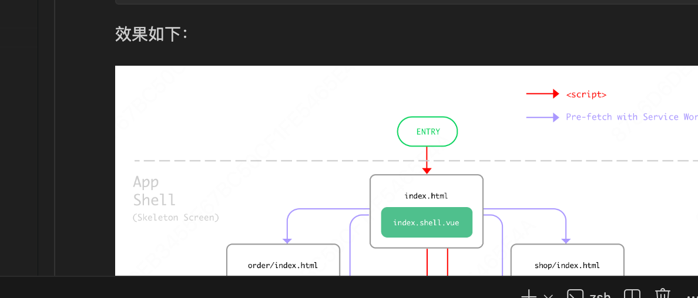

> 本文用于测试 Jekyll 博客中的图片插入方式。

## 图片插入方式

在 Jekyll 博客中插入图片，推荐使用相对路径，这样可以同时满足：
- 本地预览（localhost:4000）
- GitHub Pages 部署后展示

### 方式一：Markdown 语法

使用相对路径引用图片：

```markdown

```

  


  
  
  
  

效果如下：


### 方式二：HTML img 标签

可以控制图片大小和居中等样式：

```html

```

效果如下：


### 方式三：居中显示

```html
<center>
    
</center>
```

效果如下：

<center>
    
</center>

## 多图展示

| 图片 | 说明 |
|:---:|:---|
|  | 优化前 |
|  | 优化后 |

## 图片路径说明

项目中图片统一存放在 `/img/in-post/` 目录下：

```
img/
└── in-post/
    ├── post-eleme-pwa/          # Eleme PWA 相关图片
    ├── post-nextgen-web-pwa/    # PWA 相关图片
    ├── post-wmu/                # 其他图片
    └── ...
```

**关键点：**
1. 路径以 `/img/` 开头（绝对路径，相对于网站根目录）
2. 不要使用 `../img/` 这种相对路径
3. 这样无论是本地 `localhost:4000` 还是 GitHub Pages `rongzhenl.github.io` 都能正确展示

---

测试完成！
